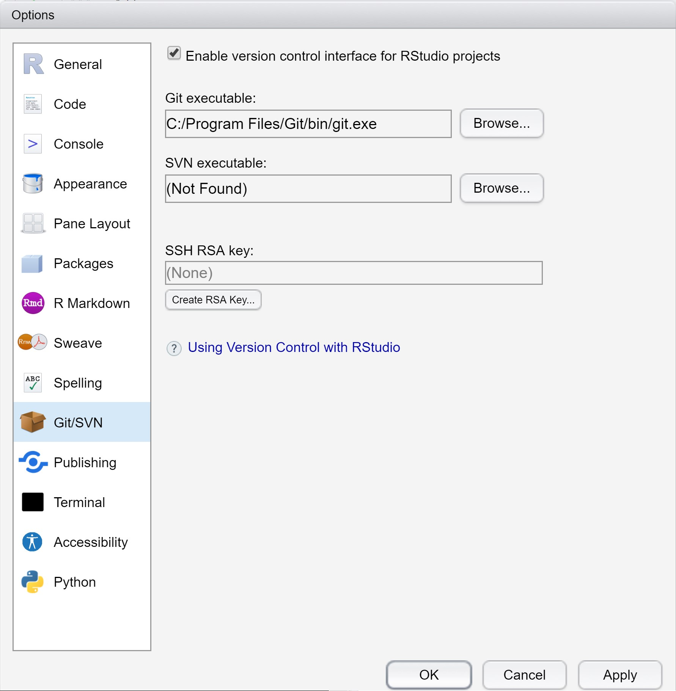
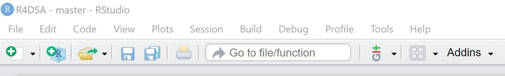

```{r setup, include=FALSE}
knitr::opts_chunk$set(echo = FALSE)
```

# Installing Git

To get started, you need to install Git in your computer.  Additionally you will also need a GitHub account.

* Download Git by using this [link](https://git-scm.com/downloads).
* Installing Git.  **Note**: It is important to provide the install Administrator right when installing Git.
* On [GitHub](https://github.com/) create yourself a free GitHub account. 


# Setup Git in RStudio 

This step aims to tell RStudio where to find the Git installation.

* Open RStudio and go to **Tools** -> **Global Options…**, click on **Git/SVN**.

Your screen should look similar to the screenshot below.    



If there is not setting or the setting is at the wrong path, 

* click on the **Browse** button behind **Git executable:**. 
* Navigate to the correct folder where Git is installed.  In general the path should be **C:/Program Files/Git/bin/git.exe** on 64bit machine on Windows OS. 
* Click on the **Apply** button to confirm the changes.
* Click on **OK** button to close the window.
* Restart RStudio, if it worked out you will find the Git icon on the top toolbar, as shown below.




# Configure Git 

In this step, you will configure Git and set your user name and email (the email address you used to register on GitHub). You can directly open the Git prompt from within RStudio. 

**Note:** User name and email needs to be set only once. 

* Go to **Tools** -> **Shell** to open the Git Shell.
* At the Shell command window, type the following commands.  


**Note:** the user.name should be the user name on Github and the user.email should be the email address you used to create Github account.

* Close Shell window.

# Reference

* If you are new to Git and Github, this [link](https://try.github.io/) provides a lot of useful resources.  

