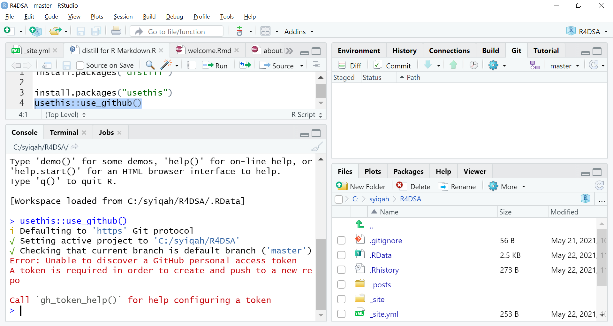
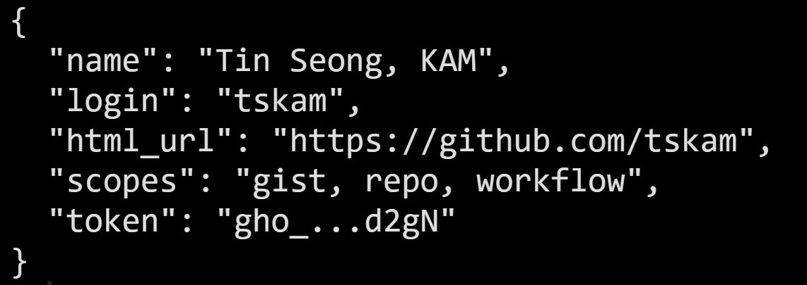
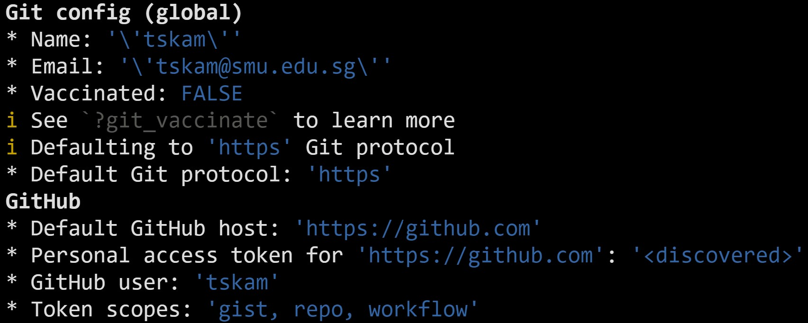
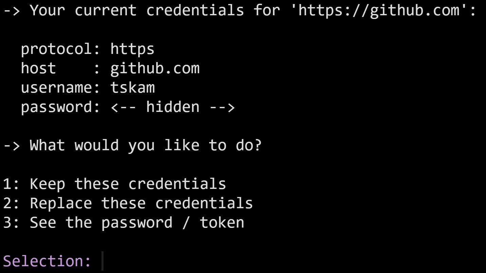

```{r setup, include=FALSE}
knitr::opts_chunk$set(echo = TRUE, eval = FALSE)
```

# Motivation

When running *usethis::use_github()* command in RStudio, you encountered error message as shown below.   



As a result, you are not able to pull or push changes made to github repository.

# Getting Started

Before you can fix the issue, you must have [**gh**](https://gh.r-lib.org/index.html) and [**gitcreds**](https://cran.r-project.org/web/packages/gitcreds/index.html) packages installed.  gh package minimalistic client to access GitHub’s [REST](https://docs.github.com/en/rest) and [GraphQL](https://docs.github.com/en/graphql) APIs. gitcreds package, on the other hand, prvodies functions to query git credentials from R. 

**Note:** You will have the **gitcreds** and **gh** packages installed, as of **usethis v2.0.0**, because usethis uses gh, and gh uses gitcreds.

# Checking the Credential

There are two ways to check for PAT is already provided in your machine.  The first method is by using *gh_whoami()* of **gh** package.  Alternatively, *git_sitrep()* of **usethis** package can be used too.

### Using gh_whoami()

* At RStudio Console, type the command below and press Enter key.

```{r}
gh::gh_whoami()
```

If you already have a PAT, your Console window should look similar to the screenshot below.    

{width=50%}

In this case, you do not have to continue the remaining steps.

If no PAT information are revealed, you will move on to next step to put your PAT into the Git credential store. 

### Using git_sitrep() 

* At RStudio Console, type the command below and press Enter key.

```{r}
usethis::git_sitrep()
```

If you already have a PAT, your Console window should look similar to the screenshot below.    

{width=75%}

**Note:** The above is an subset of the complete list display on the screen.

# Get a personal access token (PAT)

After checking the PAT information in your machine, you are ready to fix the problem.

Firstly, we need to get a PAT by typing the command below on RStudio Console followed by pressing the Enter key.

```{r}
usethis::create_github_token()
```

Assuming you’re signed into GitHub, *create_github_token()* takes you to a pre-filled form to create a new PAT. 

* Scroll all the way down the page and click on **Generate token** button.
* Copy the PAT to the clipboard (i.e. Ctrl-C).

It is a good practice to store the PAT in a file.

# Put the PAT into the Git credential store

Before we move on, we assume that you have the PAT available on the clipboard of your computer.

* At RStudio Console, type the command below. 

```{r}
gitcreds::gitcreds_set()
```

If you don’t have a PAT stored already, it will prompt you to enter your PAT.

* Paste the PAT on it (i.e. Ctrol-V).

If you do already have a stored credential, *gitcreds::gitcreds_set()* reveals this and will even let you inspect it as shown in the screenshot below. 

{width=70%}

This helps you decide whether to keep the existing credential or replace it. When in doubt, embrace a new, known-to-be-good credential over an old one, of uncertain origins.

To confirm if the PAT have been stored correctly in your machine, you can repeat the step given on **Checking the Credential** section of this tutorial.

# References

* [Managing Personal Access Tokens](https://gh.r-lib.org/articles/managing-personal-access-tokens.html) of **gh** package.
* [Managing Git(Hub) Credentials](https://usethis.r-lib.org/articles/articles/git-credentials.html) of **usethis** package.


