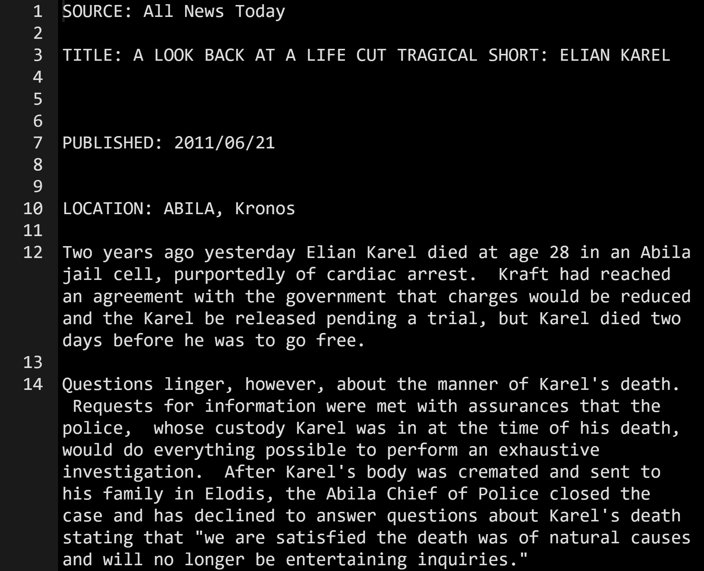
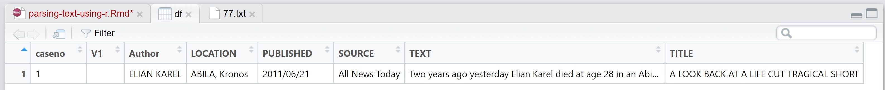
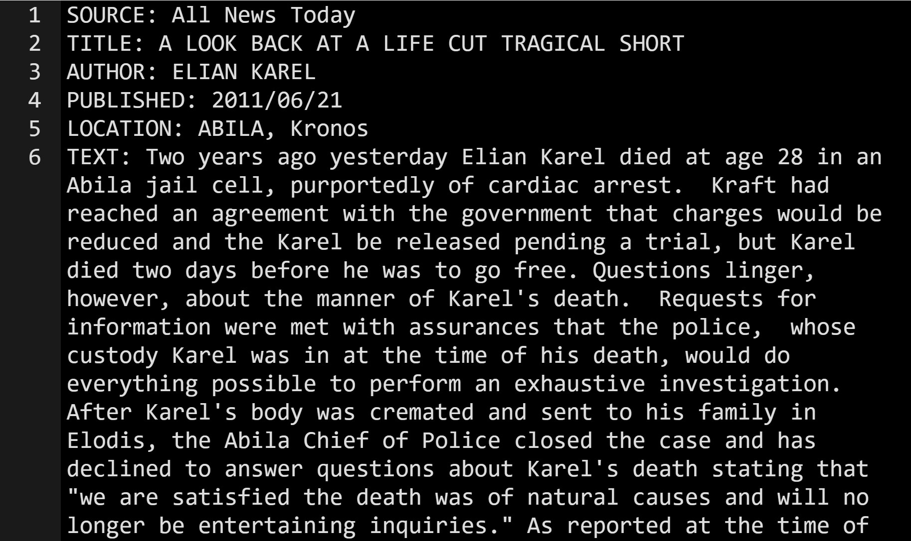
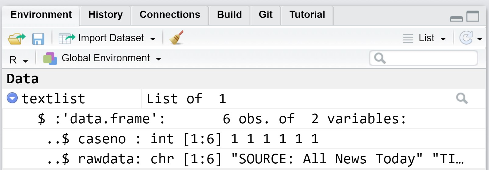
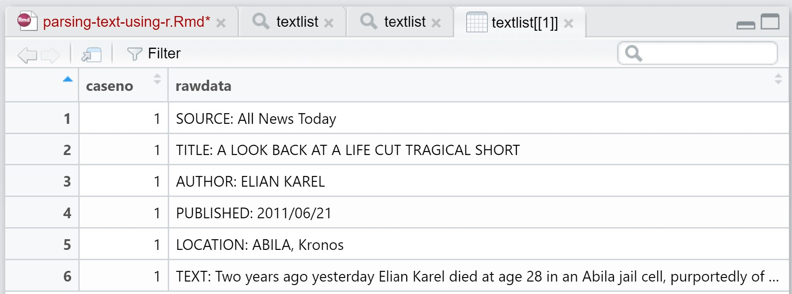
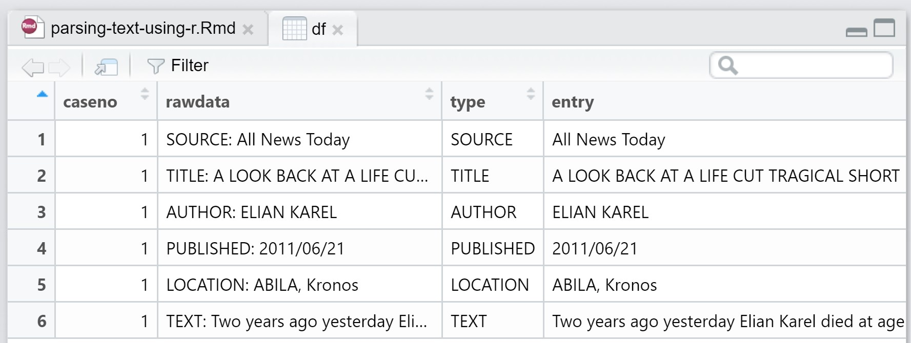
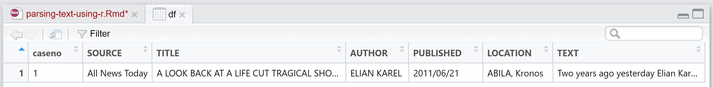

```{r setup, include=FALSE}
knitr::opts_chunk$set(echo = TRUE)
```

## Introduction

This post aims to share with you how to import a text document into R and at the same time extracting each row into column of a data.frame.

Screenshot below show how the original text document look like.

{width=75%}

In this post, we are going to learn how to extract the text and capture them into columns look similar to the screenshot below



## Getting Started

### Installing and launching R Packages

Two R packages from the tidyverse family will be used to accomplish the task, they are: [stringr](https://stringr.tidyverse.org/) and [tidyr](https://tidyr.tidyverse.org/). 

The code chunk below will be used install and launch the packages in RStudio.

```{r}
packages = c('stringr', 'tidyr')
for (p in packages){
if(!require(p, character.only = T)){
install.packages(p)
}
library(p,character.only = T)
}
```

### Tidying the text document

Before getting start, it will be wiser to tidy the text document as shown below

{width=75%}

The main changes are as follows:

- Remove all the empty lines between two sentences.
- Add "AUTHOR:" in front of the author name.
- Keep author name as a separated line.
- For **Text:** line, edit the multiple sentences into a single paragraph. 

Now, we are ready to import the text file into R.

## Reading a text file into R

First, [**lapply()**](https://www.rdocumentation.org/packages/base/versions/3.6.2/topics/lapply) of Base R is used to import the text document (i.e. 77.txt) into R as a list object called *textlist*.

```{r}
textlist <- lapply("data/77.txt", readLines)
```

The code chunk below can be used to check the newly created object. 

```{r}
textlist
```

## Converting each element of the list into a data.frame

The code chunk below is used to convert each element in the newly created list into data.frame.  The output will replaced the initial *textlist* object. 

```{r}
textlist <- lapply(1:length(textlist),
                   function(i) data.frame(
                          caseno=i,
                          rawdata=textlist[[i]],
                          stringsAsFactors = FALSE))
```

You can examine the structure of textlist object by click on it's name on the Data display panel.

{width=75%}

Notice that the object is a data.frame consisting 2 columns and 6 rows as shown in the figure below.



## Binding these into a single data frame

The code chunk below will be used to bind the list object into a data.frame. 

```{r}
df <- do.call(rbind, textlist)
```

##  Spliting the rawdata column 

The code chunk below is then used to split the *rawdata* column into two columns at the first ':'.  Two functions of **stringr** package, namely: [str_trim()](https://stringr.tidyverse.org/reference/str_trim.html) and [str_split_fixed()](https://stringr.tidyverse.org/reference/str_split.html) are used to complete the task.     

```{r}
df[,c("type","entry")] <- str_trim(str_split_fixed(df$rawdata,":",2))
```

Notice that the newly created two columns are called *type* and *entry* as shown in the screenshot below



## Transposing from 'long' to 'wide' format 

Lastly, the [pivot_wider()](https://tidyr.tidyverse.org/reference/pivot_wider.html) of tidyr package will be used to transpose the two columns into multiple columns data.frame as shown in the screenshot below.

```{r}
df <- df[,c("caseno","type","entry")]
df <- pivot_wider(df,
                  names_from = type,
                  values_from = entry)
```




