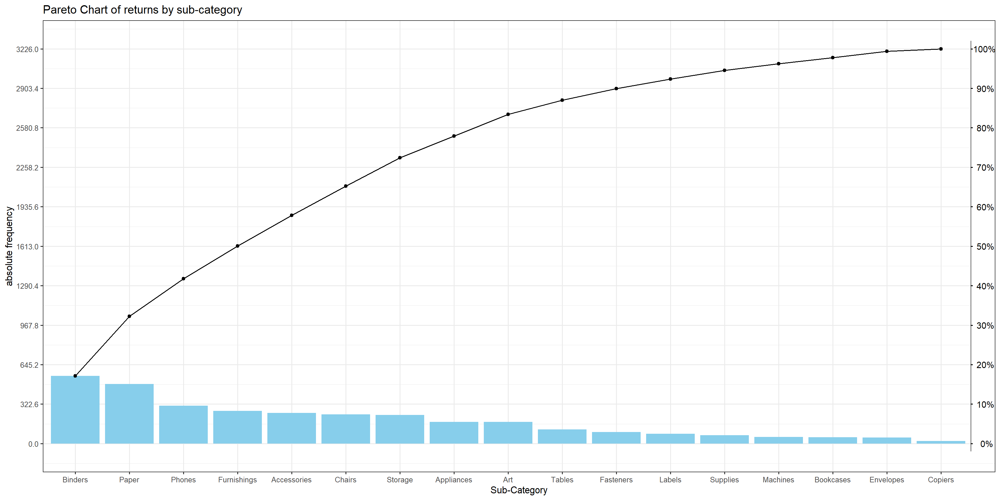
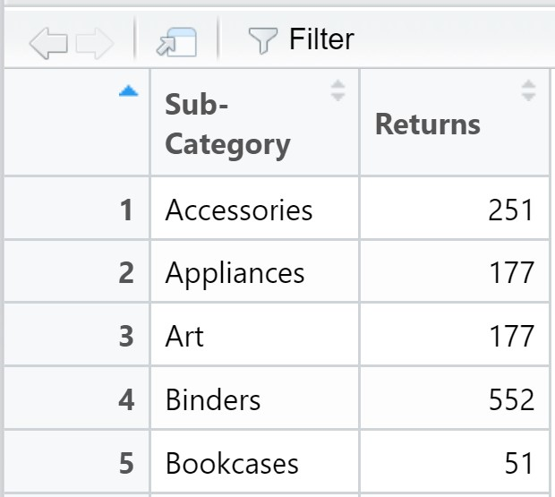
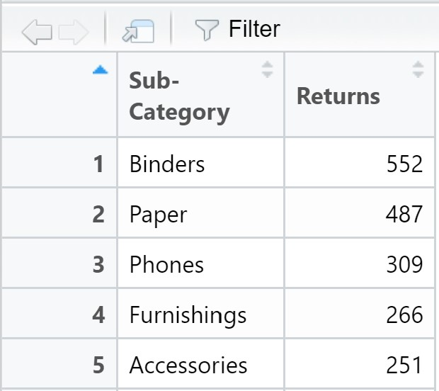
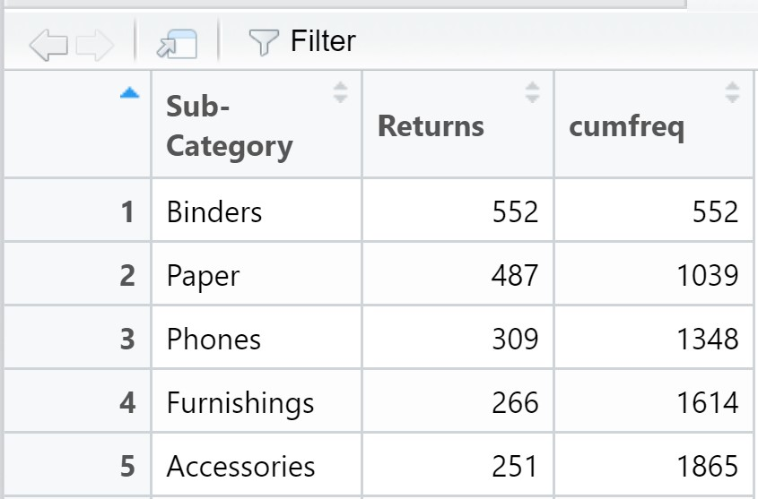

```{r setup, include=FALSE}
knitr::opts_chunk$set(echo = TRUE)
```

# Overview

Pareto chart is a popular data visualisation use to reveal something like the [80-20 rule](https://en.wikipedia.org/wiki/Pareto_principle). 


The purpose of the Pareto chart is to highlight the most important among a (typically large) set of factors.  In market share study, Pareto charts are useful to reveal if the business is dominated by a handful of key products or customers.  In general, businesses will try to avoid their businesses over-dependent by a few products or customers because if something happen to their key products or business partners, the businesses will be very badly affected.  

In the nutshell,  a Pareto chart is a dual axis chart.  The y-axis on the left (also known as primary y-axis) shows the absolute frequency of the observations and their values are presented as bars.  The y-axis on the right shows the cumulative frequency of the observed values and they are presented as dots.  These dots are then joined by a smooth line. 

## The Task

In this exercise, we are going to create a pareto chart showing the distribution of returns by product sub-category by using a data set from a retail store group.

# Getting started
## Installing and loading the required libraries

Figure below shows the workflow of a typical data science and analytics process and the tidyverse R packages that specially designed to support the specific tasks in the data science and analytics process.


Before we get started, it is important for us to ensure that the required R packages have been installed.  For the purpose of the exercise, the follow tidyverse packages will be used:

+ [reaxl](https://readxl.tidyverse.org/) package will be used to read and parse a worksheet into R as a tibble data frame format.  (It is important to note that the R object is in tibble data frame and not the generic data frame).
+ [dplyr](https://dplyr.tidyverse.org/) package will be used to perform data transformation and data wrangling tasks 
+ [ggplot2](https://ggplot2.tidyverse.org/) package will be used to building the pareto chart by using the principle of [Layered Grammar of Graphs](https://vita.had.co.nz/papers/layered-grammar.html). 

{width=45%}


The code chunk below is used to check if the necessary R packages are installed in R.  If they have yet, then RStudio will install the missing R package(s).  If are already been installed, then they will be launch in R environment.

```{r}
packages = c('tidyverse', 'readxl', 'knitr')

for(p in packages){
  if(!require(p, character.only = T)){
    install.packages(p)
  }
  library(p, character.only = T)
}
```

It is important note that **readxl** package has to be listed separately in the packages list because it is not part of the core tidyverse package.

# Data Import

In this exercise, superstore-2021 data set will be used in this example.  It is an MS Excel workbook.  It consists of three worksheets, namely: Orders, People and Returns.  

The code chunk below imports *superstore-2021.xls* into R environment by using [*read_csv()*](https://readr.tidyverse.org/reference/read_delim.html) function of **readr** package.

```{r, echo=TRUE, warning=FALSE, message=FALSE}
orders <- read_xls("data/Superstore-2021.xls",
                  sheet = "Orders")
returns <- read_xls("data/Superstore-2021.xls",
                  sheet = "Returns")
```

After parsing the worksheet into R, it is a good practice to check the structure and content of the newly tibble data frames in RStudio.

# Data Wrangling

## Joining the two data frames 

In this step, the [*left_join()*](https://dplyr.tidyverse.org/reference/mutate-joins.html) of **dplyr** is used to join the returns data frame and orders data frame by using Order ID as the unique identifier.

```{r}
joined_tab <- left_join(returns, orders,
                        by = c('Order ID' = 'Order ID'))
```

To learn more about Join of dplyr, click on this [link](https://dplyr.tidyverse.org/articles/two-table.html).


## Compute the frequency count by Sub-Category

Next, we are going to compute the frequency count of returns by sub-category.  There are two ways to complete the task.  The first way is by using the *group-by* method and the second way is by using the *count* method of dplyr.  

### The *group-by* method

In the code chunk below, [group_by()](https://dplyr.tidyverse.org/reference/group_by.html) of dplyr package is used to group the orders by Sub-Category.  Then, [summarise()](https://dplyr.tidyverse.org/reference/summarise.html) of dplyr is used to count (i.e. [n()](https://dplyr.tidyverse.org/reference/context.html)) the number of returned orders.      

```{r}
freq_returned <- joined_tab %>%
  group_by(`Sub-Category`) %>%
  summarise('Returns' = n()) %>%
  ungroup()
```


### The *count* method

The code chunk below shows the alternative way to derive the frequency of returns by sub-category.  In this case, [count()](https://dplyr.tidyverse.org/reference/count.html) of dplyr package is used. 

```{r eval=FALSE}
freq_returned <- joined_tab %>% 
  count(`Sub-Category`) %>%
  rename(Returns = n)
```


By default, *count()* will return a new field called *n* to store the result.  In view of this, [*rename()*](https://dplyr.tidyverse.org/reference/rename.html) of **dplyr** is used to rename *n* to *Returns*.

## Sorting data

By default, the values of the tibble data frame is sorted according to the values of the first column.  In this case, the values are sorted alphabetically by Sub-Category field as shown in the figure below

{width=30%}

Before we can compute the cumulative frequency, we need to sort the values in the sub-category field by the values in the Returns field.  To accomplish this task, the [*arrange()*](https://dplyr.tidyverse.org/reference/arrange.html) of **dplyr** package is used as shown in the code chunk below.  

```{r}
freq_sorted <- freq_returned %>%
  arrange(desc(Returns))
```

The sorted data frame should look similar to the screenshot below.

{width=30%}

## Computing the cumulative frequency

Out next task is to compute the cumulative frequency of returns by product sub-category.  This task will be performed by using [mutate()](https://dplyr.tidyverse.org/reference/mutate.html) of dplyr package and [cumsum()](https://www.rdocumentation.org/packages/base/versions/3.6.2/topics/cumsum) of Base R.


```{r}
freq_cum <- freq_sorted %>%
  mutate(cumfreq = cumsum(Returns))
```

The newly computed cumulative frequency values will be stored in a new field called *cumfreq* as shown in the screenshot below.

{width=40%}


